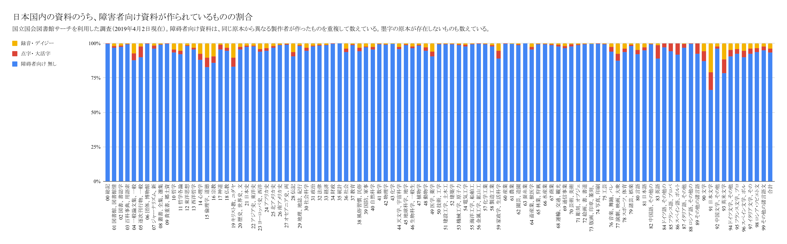

# 日本国内の資料のうち、 障害者向け資料が作られているものの割合

国立国会図書館サーチを利用した調査（2019年4月2日現在）。障碍者向け資料は、 同じ原本から異なる製作者が作ったものを重複して数えている。

 <!-- Trigger the Modal -->

<!-- The Modal -->

  <!-- The Close Button -->
  &times;

  <!-- Modal Content (The Image) -->
  

  <!-- Modal Caption (Image Text) -->
  
グラフ：日本国内の資料のうち、 障害者向け資料が作られているものの割合

日本 十進 分類 区分|障碍者 向け 資料の 無い 図書|点字・ 大活字|録音 図書・ デイジー 図書
:---|---:|---:|---:
00 総記|751541|1750|1296
01 図書館、 図書館情報学|94247|1178|1841
02 図書、 書誌学|103329|1159|1721
03 百科事典、 用語索引|43262|176|164
04 一般論文集、 一般講演集、 雑著|42400|2288|3552
05 逐次刊行物、 一般年鑑|79195|6741|2036
06 団体、 博物館|22717|55|53
07 ジャーナリズム、 新聞|43848|994|753
08 叢書、 全集、 選集|66735|183|573
09 貴重書、 郷土資料、 その他の 特別 コレクション|70400|118|119
10 哲学|16773|387|778
11 哲学各論|9723|286|559
12 東洋思想|56445|319|807
13 西洋哲学|25940|361|856
14 心理学|64910|3184|5588
15 倫理学、 道徳|69691|5827|8817
16 宗教|27730|1497|3022
17 神道|29936|1102|333
18 仏教|133257|2832|4635
19 キリスト教、 ユダヤ教|54031|4080|6818
20 歴史、 世界史、 文化史|63634|1118|1760
21 日本史|522273|4538|8742
22 アジア史、 東洋史|64244|411|973
23 ヨーロッパ史、 西洋史|22597|400|1023
24 アフリカ史|3037|64|109
25 北アメリカ史|6695|92|135
26 南アメリカ史|2617|12|23
27 オセアニア史、 両極地方史|2862|18|10
28 伝記|205025|7395|14090
29 地理、 地誌、 紀行|576328|4659|7248
30 社会科学|203831|4599|6931
31 政治|396494|3205|6080
32 法律|328834|2170|3174
33 経済|558459|2551|5161
34 財政|119956|146|259
35 統計|134896|32|20
36 社会|425429|10941|17677
37 教育|695603|4699|5589
38 風俗習慣、 民俗学、 民族学|129586|3470|4436
39 国防、 軍事|49726|465|1082
40 自然科学|60974|1351|1580
41 数学|100618|540|279
42 物理学|48473|170|318
43 化学|39018|97|114
44 天文学、 宇宙科学|23293|384|615
45 地球科学、 地学|97289|491|750
46 生物科学、 一般生物学|48210|569|1145
47 植物学|32167|242|339
48 動物学|57673|1520|1788
49 医学、 薬学|428948|17591|27815
50 技術、 工学|156064|364|512
51 建設工学、 土木工学|231342|611|1010
52 建築学|95449|275|446
53 機械工学、 原子力工学|99035|438|852
54 電気工学|114099|1312|1250
55 海洋工学、 船舶工学、 兵器、 軍事工学|43187|83|160
56 金属工学、 鉱山工学|40416|40|79
57 化学工業|52850|117|182
58 製造工業|59297|631|762
59 家政学、 生活科学|143158|8832|8696
60 産業|118029|121|179
61 農業|273656|516|762
62 園芸、 造園|71170|323|603
63 蚕糸業|21298|5|12
64 畜産業、 獣医学|49050|938|1325
65 林業、 狩猟|71858|176|283
66 水産業|59019|204|228
67 商業|162054|896|1356
68 運輸、 交通、 観光事業|146252|1621|1643
69 通信事業|45533|704|916
70 芸術、 美術|131260|2044|830
71 彫刻、 オブジェ|14245|63|120
72 絵画、 書、 書道|447014|1636|2028
73 版画、 印章、 篆刻、 印譜|10440|18|32
74 写真、 印刷|56350|80|114
75 工芸|68541|207|329
76 音楽、 舞踊、 バレエ|177548|6588|5036
77 演劇、 映画、 大衆芸能|77577|4315|6766
78 スポーツ、 体育|129070|3576|5314
79 諸芸、 娯楽|73202|799|720
80 言語|23850|792|1211
81 日本語|92996|2247|2730
82 中国語、 その他の東洋の諸言語|33882|190|96
83 英語|51320|5469|804
84 ドイツ語、 その他のゲルマン諸語|11023|341|2
85 フランス語、 プロバンス語|5294|310|3
86 スペイン語、 ポルトガル語|3546|307|3
87 イタリア語、 その他のロマンス諸語|1216|36|4
88 ロシア語、 その他のスラブ諸語|3323|9|1
89 その他の諸言語|8686|689|10
90 文学|76875|6179|5087
91 日本文学|820443|157635|259708
92 中国文学、 その他の東洋文学|60390|1020|1386
93 英米文学|147488|18808|22141
94 ドイツ文学、 その他のゲルマン文学|41757|2181|2222
95 フランス文学、 プロバンス文学|49474|1701|2271
96 スペイン文学、 ポルトガル文学|5978|305|353
97 イタリア文学、 その他のロマンス文学|8336|324|357
98 ロシア・ソビエト文学、 その他のスラブ文学|21160|588|825
99 その他の諸言語文学|6393|188|161
総数|11966392|345309|505506

