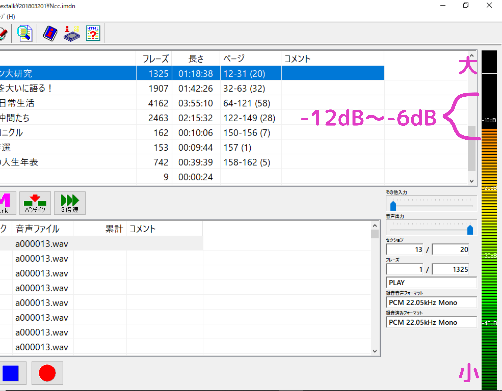

# パソコンで音訳する場合の作業手順
{:.no_toc}

## 目次
{:.no_toc}

* TOC
{:toc}

## 1. 作業に必要な機器類

1. パソコン
2. デイジー図書作成ソフトウェア（シナノケンシ株式会社製PLEXTALK Recording Software Pro）
3. USBマイク・マイクスタンド または  
   USBオーディオインターフェース（音量調節可能なもの）、マイク・マイクスタンド  
   どちらか片方
4. ヘッドホンまたはイヤホン
5. DAISY音訳表用紙
6. 調査表用紙
7. 「録音図書凡例」原稿（編集者に相談）
8. USBメモリ（2～4G）またはCFカード・カードリーダー（校正者がDR-1を使用する場合）

## 2. 原本の下読み等

1. 原本の下読みをする。
2. 漢字・固有名詞の読みを調べて調査票に必要事項を記載する。
   - 調査した事項は典拠を明示する。
   - 図書館・北区依頼の原本や、やまびこ購入の原本は書き込み可。
3. 単語・語句のアクセント・イントネーションを調べる。
4. 写真や図の位置を確認して、本文のどの位置で説明を入れるか考えておく。
   - 説明文はあらかじめ原稿を作成する。
5. ルビの付いている単語・語句は、しっかり読みを確認する。
   - ルビは初出だけの場合が多いので、2回目以降の読みがルビと違わないように読みを覚えておくかリストにして手元に置く。
6. 録音図書凡例（階層、グループチェック等）を編集者に相談し決める。
7. DAISY音訳表に必要事項を記入する。

## 3. 初めてDAISY図書の作成にかかわる場合

1. PLEXTALK Recording Software Pro（以下、PRSPという）をインストールする。
2. DAISY TOKYO作成の「はじめてのDAISY」（以下、「はじめてD」という）に従って、作業に必要な各種設定をする。

## 4. PRSPのバージョンアップ

1. 使用しているPRSPのバージョンの確認  
   PRSPを開いた状態でF1キーを押すとバージョンを確認できる。
2. 新しいバージョンのインストール  
   使用中のものより新しいバージョンがあるかどうかを以下のところで確認し、新しいものがあればダウンロードし、インストールする。  
   [プレクストーク » ダウンロード 3. PRSProアップグレード専用インストーラ](http://www.plextalk.com/jp/products/prspro/download/#03)  
   上のページは、以下の手順によっても開くことができるはず。  
   「プレクストークダウンロード」で検索→「プレクストーク » ダウンロード - PlexTalk.com」 →ダウンロードリストの「3. PRSProアップグレード専用インストーラ」を選択する。  
   - CDキーを訊かれたら、インストールファイルの管理者に問い合わせる。

## 5. 録音をする

### 5.1. 事前準備

1. PRSPの作業では、パソコンのスクリーンセーバーや省電力関係の設定は「なし」にする。（「はじめてD」P.5）
2. ノート型パソコンでの録音時には安定した電源供給を確保する。（「はじめてD」P.97）
3. パソコンの内臓マイクは無効化する。（「はじめてD」P.99）
4. 録音はPCM形式で行う。（「はじめてD」P.10、66）
5. 書誌情報の内、わかるものは入力しておく。（「はじめてD」P.12）
6. ディスク情報（ドライブの残り容量）を確認する。（「はじめてD」P.14）
7. 録音設定を確認する。（「はじめてD」P.15）
   - 「新規作成時に開くフォルダ」欄には、「DAISY作業」と入れる。このフォルダの中にそれぞれの音声データを、名前を付けて保存していくことになる。

### 5.2. データのバックアップ

以下の作業内容はすべて、PRSPが勝手に上書き保存している。また、PRSPには「名前を付けて保存」という機能がない。一旦PRSPを閉じてしまうと、昔の作業状態に戻すことができない。（PRSPを閉じない限り、Ctrl+Zキーで以前の状態に戻すことができる。）

途中経過の作業内容を残しておきたい場合は、Windowsに付属の「エクスプローラー」でコピー・貼り付けするなどの方法で、プロジェクトフォルダを別の名前で保存しておく。その際、プロジェクトフォルダが入れ子状態にならないように、保存場所に気をつける。

但し、プロジェクトフォルダのコピーの数が増えれば、ハードディスクの空き容量が減るので、必要に応じて古すぎるコピーを削除する。

### 5.3. 録音

1. マイクスタンドの下にタオル等を敷いて、振動が録音に影響しないように工夫する。
2. マイクとの距離に注意する。
3. 音量や雑音に注意する。  
   音量は -12dB（小）から -6dB（大）の間 に保つ。  
   （図1：画面右端、縦バーに音量メモリがある。下が小、上が大。）  
   
   - 急に声が大きくなったり小さくなったりしないよう注意する。
   - ピッチを落として括弧（&emsp;&emsp;&emsp;）内を読むときは低くなりすぎないよう、不明瞭にならないよう注意する。
   - 文章の一部分を読み直すときは、声の調子や音量が前後の部分と変わらないよう注意する。
   - ページを繰る音、物を動かす音などに注意する。
4. 録音方法が「上書き」になっていることを確認する（「はじめてD」P.19）
5. 区切りのよいところで戻してモニターし、正しくきれいに録音されているか確認しながら読み進めていく。
6. DAISY図書として必要な項目を入れる。
   - タイトルコール （題名と著者名のみ。著者多数の場合は○○他□名でもよい。）
   - 録音時間 「録音時間約□時間□□分」
   - 著作権ガイド  
     例： 図書館依頼の本（雑誌）の場合  
     「この図書（雑誌）は著作権法に基づき、障害や高齢等の理由で通常の活字による読書が困難な人のために、東京都北区立中央図書館が製作したものです。」
7. 「録音図書凡例」、「録音図書凡例終わり」を入れる。
   - 編集者と相談して決めた「録音図書凡例」原稿を読む。
   - 録音例：セクションを2階層とし、写真（カラーとモノクロが混在）にグループをつけている場合。  
     「録音図書凡例。  
     このデイジー版は2レベルです。  
     レベル1は、表紙、目次、章の見出し、奥付などです。  
     レベル2は小見出しです。  
     写真の始めと終わりにグループを付けています。  
     写真がカラーの場合のみ、カラー写真と言います。  
     録音図書凡例終わり」
8. 表紙、表紙折り返し部分等を読む。それぞれに「○○終わり」を入れる。
   - 表紙カバーを表紙として読む。
   - 図書館依頼の場合は表紙の帯は読まない（図書館蔵書は帯をはずすので）。
   - 「表紙」はおもて表紙を指すので、表紙に「おもて」は付けない。  
     「表紙」→説明→「表紙終わり」  
     「裏表紙」→説明→「裏表紙終わり」  
     「表紙折り返し部分より」→説明→「表紙折り返し部分終わり」  
     「裏表紙折り返し部分より」→説明→「裏表紙折り返し部分終わり」
   - 著者紹介が本文になく、表紙折り返し部分の著者紹介を読む場合  
     「著者紹介」「表紙折り返し部分より」→読む→「著者紹介終わり」「表紙折り返し部分終わり」
9. 原本凡例がある場合は「原本凡例終わり」を、目次の後には「目次終わり」を入れる。
10. 括弧始めの記号 ( 「 〔 …を読んだときは、対になる括弧終わりの記号 ） 」 〕 …を読み落とさないよう注意する。  
   例： 旧岩淵水門（赤水門）を眺め  
   →旧岩淵水門 **かっこ** 赤水門 **かっことじ** を眺め
11. 著者紹介、奥付・・・の後に「○○終わり」を入れる。  
    表紙カバー裏に定価が記載されている場合は、「奥付終わり」の直前に定価を入れる。
12. 終わりのアナウンスを入れる。
    「以上で （書名） を終わります」  
    「制作完了 （西暦） 年  月」  
    「制作は 東京都北区立中央図書館でした」 ＋ 「無音3秒」または  
    「制作は 音訳グループやまびこでした」 ＋ 「無音3秒」

### 5.4. 校正者に渡すデータを準備する

1. ビルドブックをする。ビルドブックしないと訂正録音の部分が反映されない。
2. 録音完成データのみを、空のUSBメモリにコピーする。
3. 校正者がDR-1を使用する場合は、カードリーダーを使用して録音データを空のCFカードにコピーする。CFカードにデータが残っている状態でコピーするとDR-1でデータを読み取れなくなるので注意する。

## 6. 校正者に渡す資料

1. 原本
2. USBメモリまたはCFカード
3. DAISY音訳表
4. 調査票
5. その他（写真説明原稿等）

## 7. 校正後に返却されたUSBメモリ、CFカードの取り扱い

1. 校正マークやコメントの付いたUSBメモリのデータを、音訳者の手元にあるマークのついていないデータとは別にしてパソコンのハードディスクにコピーする。名前も変える。
2. CFカードは、カードリーダーを使用してデータをパソコンのハードディスクにコピーする。
3. データをパソコンにコピーしたら、USBメモリやCFカードは安全な取り外し方で外す。
4. 校正者の指摘した箇所についてチェック・検討し、直すべきと判断したものは直す。
   - 校正者がマークしたフレーズに飛ぶ、戻る方法  
     飛ぶ ― Ctrlキーを押しながら右矢印キーを押す。  
     戻る ― Ctrlキーを押しながら左矢印キーを押す。

## 8. 編集者に渡す資料

1. 原本
2. USBメモリ
3. DAISY音訳表
4. 調査票
5. 校正表
6. その他（写真説明原稿等）

