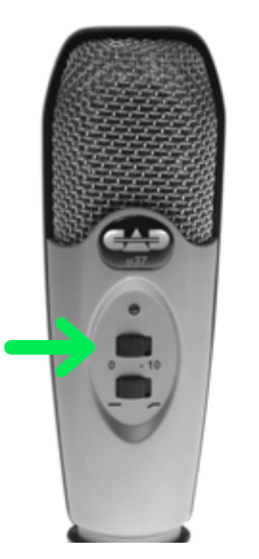

---
layout: caymanyomi
title: 音質を考慮した録音製作
author: 水野光子
date: 2018-11-29T12:20:32Z
iro: cb581f
gra: ffceb7
math: true
---

# 音質を考慮した録音製作
{:.no_toc}

## 目次
{:.no_toc}

* TOC
{:toc}

## 1. 音質とは

「製品の音質」の定義をした研究者は多いが、その定義の仕方には共通点がある[^porter1997]。

[^porter1997]: [Porter, N.&nbsp;D. and Berry, B.&nbsp;F.: A study of standard methods for measuring the sound quality of industrial products: final report. *CIRA (EXT) 021*, 1997. p.&nbsp;5.](http://publications.npl.co.uk/dbtw-wpd/exec/dbtwpub.dll?&QB0=AND&QF0=ID&QI0=%20000912%20&TN=NPLPUBS&RF=WFullRecordDetails&DL=0&RL=0&NP=4&AC=QBE_QUERY)

以下の3種類の定義は、20世紀の終わり頃に発表されたものだ。

製品音質
: 1つの製品に付随する音の適切さを記述するもの。対象となる音の各種聴覚特性についての総合的判断に由来する。それは、利用者の実際の認知的状態・情緒的状態において明らかな、製品に対して期待される聴覚的特徴の集合に関連して判断される。 (Jekosch and Blauert, 1996[^jekosch1996].)
{::comment}
Product-sound quality
A descriptor of the adequacy of a sound attached to a product. It results from judgements upon the totality of auditory characteristics of the said sound - the judgements being performed with reference to a set of those desired features of the product which are apparent in the users actual cognitive and emotional state.
{:/comment}

[^jekosch1996]: Jekosch, U. and Blauert, J.: A semiotic approach toward product sound quality. *Proceedings of Internoise,* 96, pp.&nbsp;2283-2288. 1996.

音響品質
: ある聴覚事象に対する各種要求が満たされる総合的な度合い。 (Genuit, 1996[^Genuit1996].)
{::comment}
Acoustic quality
The degree to which the totality of the individual requirements made on an auditory event are met.
{:/comment}

[^Genuit1996]: Genuit, K.: Objective evaluation of acoustic quality based on a relative approach. *Proceedings of Internoise,* 96, pp.&nbsp;3233-3238. 1996.

音質
: 音質 (Sound Quality, SQ) は1つの製品の音に対する知覚的反応である。 その製品の音の容認性に対する、聞く人の反応を反映する。 容認性が高いほど、SQが高い。 (Lyon, 2000[^lyon2000].)
{::comment}
Sound quality
Sound Quality (SQ) is the perceptual reaction to the sound of a product that reflects the listener’s reaction to the acceptability of that sound for that product; the more acceptable, the greater the SQ.
{:/comment}

[^lyon2000]: Lyon, R.&nbsp;H.: *Designing for Product Sound Quality,* p.&nbsp;8. Marcel Dekker Inc. New York, 2000.

上のどの定義にも共通する点は、音質が、

1. 知覚に関連すること、そして、
2. 特定の要求に照らし合わせた聴覚特性の総合的判断に依存すること

である。

## 2. 音質に影響を与える要素は、どうやって測定するか？

音質がどういうものから構成されるかということについて、決定的な説明は存在しない[^coxSIRC]。

[^coxSIRC]: [Cox, T.: *Sound quality - making products sound better.* Acoustics Reserarch Centre, Salford Innovation Research Centre (SIRC), University of Salford, Manchester, 2018.](https://www.salford.ac.uk/research/sirc/research-groups/acoustics/psychoacoustics/sound-quality-making-products-sound-better)  
    Page "An introduction to Sound Quality testing. Defining sound quality."

それでも、「1. 音質とは？」で紹介した定義を考慮すると、
音が発生してからその音質を特定するまでの間には、以下のような3つの段階が考えられる。

1. 音の発生、
2. 音の知覚、
3. 聞く人の判断。

「1. 音の発生」は、物理的・工学的な性質として測定できる。録音の条件だけでなく、録音したものを再生する条件にも左右される。

「2. 音の知覚」は、音響心理学の観点から、どういう音を聞かせるとどのように聞こえるかを調べることができる。

「3. 聞く人の判断」は、心理学的な効果や法則に支配される。

録音製作は「1. 音の発生」のための準備段階でしかないので、音質の改善のために直接できることは無い。せいぜい、音質の評価を下げそうな要素をできるだけ取り除いておくという程度のことしかできない。

## 3. 録音製作で音質のためにできること

音質の評価を下げそうな要素をできるだけ取り除くために、録音製作者が実際に努力していることは、音の再現性を高めることだ。 つまり、生の音の物理的性質を、できるだけ取りこぼさずに記録することだ。

ただし、再現性が音質に直接関係しているわけではない。 再現性は物理的な性質に過ぎないが、音質の特定には、音響心理学や、心理学的効果や法則も関わってくるからだ。

再現性の低い録音は、生の音の物理的性質の一部を無視しているので、音質を下げないために必要かもしれない情報を、再生機に渡しそこねる可能性がある。

逆に、再現性の高い録音であれば、音質を下げないために必要かどうかにかかわらず、生の音声に関する可能な限り多くの情報を再生側に渡すのだから、再生した結果、音質が低いと評価されたとしても、それは再生側の問題であり、録音には責任がないということになる。

## 4. 再現性に影響する機械の特性

### 4.1. 録音に使う機械の仕様書を理解するための予備知識

録音に使う機械の仕様書を見れば、それを使った録音の再現性の高さをある程度比較できる。 その比較に必要な予備知識をここに紹介する。

録音する際には、音声情報は以下のような経路を通って記録される。

DR-1で録音する場合
:   - マイクで音をアナログの電気信号に変換
    - ケーブルとコネクタを通して、アナログの電気信号をDR-1に送信
    - DR-1 内部でアナログの電気信号をデジタル化
    - デジタル情報をCFカードに記録

マイク、オーディオ・インターフェイス、パソコンを繋げて録音する場合
:   - マイクで音をアナログの電気信号に変換
    - ケーブルとコネクタを通して、アナログの電気信号をオーディオ・インターフェイスに送信
    - オーディオ・インターフェイス 内部でアナログの電気信号をデジタル化
    - デジタル情報をUSBケーブルでパソコンに送信し、ハードディスクに記録

USBマイクをパソコンに繋げて録音する場合
:   - マイクで音をアナログの電気信号に変換し、その場でアナログの電気信号をデジタル化
    - デジタル情報をUSBケーブルでパソコンに送信し、ハードディスクに記録

以上の経路の中で、録音の再現性に影響する主な箇所は、以下のところである。

1. 「マイクで音をアナログの電気信号に変換する」ところ。
   - 音の成分のうち、アナログの電気信号に変換されない成分が多ければ、録音の再現性が下がる。
2. 「ケーブルとコネクタを通して、アナログの電気信号を」次の機械に送るところ。
   - ケーブルやコネクタを通っていくアナログの電気信号に対して、周辺からの電気的なノイズが入る。 このノイズは、もともとマイクが受け取った音声とは関係ないので、これによって録音の再現性が落ちる。
3. 「アナログの電気信号をデジタル化」するところ。
   - アナログの電気信号は連続的な情報を持つが、これが離散的な記号の列（デジタル情報）に変換される。 そのために、情報の一部が削ぎ落とされ、録音の再現性が落ちる。

### 4.2. 録音に使う機械の仕様

東京都北区立中央図書館デジタル工房の録音室1には、DR-1用のセットとパソコン録音用のセットが置いてある。 それぞれの機械の仕様書を比較してみる。 また、オーディオ・インターフェイスを使う人もいるので、 デイジー録音で一般的に使われているらしい Roland の UA-1EX と UA-1G の仕様にも言及する。

#### 4.2.1. マイクの仕様

マイクは音をアナログの電気信号に変換するが、その際に再現性に影響を与える仕様のうち、ここでは以下の2つの点に注目する。

周波数特性 (Frequency Response)
: マイクの振動板に低音（低周波数）から高音（高周波数）まで一定の音圧を与えたときに、このマイクで拾える音の周波数の範囲。 範囲が広いほど再現性が高い。

感度 (Sensitivity)
: マイクの振動板に特定の音圧を与えたときに出力される信号の振幅。 dBV という単位なら負の数で表され、0に近いほど感度が高い。  
    ただし、マイクの感度が高ければ、環境音や口中音など、録音したい音以外の音も正確に再現される。 そういう要らない音が録音されないようにするには、マイクやオーディオ・インターフェイスのスイッチやダイヤルで、感度を少し下げるように調整する。 USBマイクの場合はマイク本体に PAD (Passive Attenuation Device, 減衰器) を操作するスイッチやダイヤルが付いている。

録音室1にある2つのマイクの仕様は以下のようになっている。

機器 | DR-1 用マイク | パソコン用USBマイク
型名 | [SHURE SM58](https://www.shure.com/americas/products/microphones/sm/sm58-vocal-microphone) | [CAD Audio U37](http://cadaudio.com/products/product-application/u37)
構造 | ダイナミックマイク | コンデンサマイク
周波数特性 | 50 Hz から 15 kHz | 20 Hz から 20 kHz
感度 | -56.0 dBV @ 1Pa | -40 dBV @ 1Pa

どちらも一般向けの（プロ用ではない）マイクとしては標準的な仕様であり、特に高性能でも低性能でもないが、上記の数値を比較すれば、録音室1の DR-1 用マイクよりもパソコン用USBマイクのほうが、再現性を下げる要素が少ないことがわかる。

ただし、USBマイクの方は感度が高いので、再現性が高い反面、要らない音も正確に録音されてしまう。 初めて使う時は、感度を調整するスイッチを切り替えて、どちらのスイッチの方が望み通りの音を録音できるか、確認すると良い。

実際にスイッチを切り替えて、4種類の録音をしてみた。
{: srcset="media/quality/mic_u37.svg" .hidari}

このページの音声を再生するとき、イヤフォンやヘッドフォンで聞くと、違いがわかりやすくなる。
{: .note}

1. 大きい声で、感度を低減しない場合  
    <audio controls>  
      <source src="media/quality/prsL_0.ogg" type="audio/ogg">  
      <source src="media/quality/prsL_0.mp3" type="audio/mpeg">  
      お使いのブラウザでは表示できません。  
    </audio>  
    感度が高すぎて、部屋の反響が入っているように聞こえる。
2. 大きい声で、感度を-10dBで低減した場合  
    <audio controls>  
      <source src="media/quality/prsL_-10.ogg" type="audio/ogg">  
      <source src="media/quality/prsL_-10.mp3" type="audio/mpeg">  
      お使いのブラウザでは表示できません。  
    </audio>  
    反響が抑えられたように聞こえる。
3. 小さい声で、感度を低減しない場合  
    <audio controls>  
      <source src="media/quality/prsS_0.ogg" type="audio/ogg">  
      <source src="media/quality/prsS_0.mp3" type="audio/mpeg">  
      お使いのブラウザでは表示できません。  
    </audio>  
    感度が高すぎて、口中音が目立つかもしれない。
3. 小さい声で、感度を-10dBで低減した場合  
    <audio controls>  
      <source src="media/quality/prsS_-10.ogg" type="audio/ogg">  
      <source src="media/quality/prsS_-10.mp3" type="audio/mpeg">  
      お使いのブラウザでは表示できません。  
    </audio>  
    口中音が低減されたように聞こえる。

#### 4.2.2. アナログの電気信号を伝える部分の仕様

USBマイクの場合、アナログの電気信号を伝える部分はマイク本体の内部で完結しているので、アナログの電気信号に対する電気的ノイズの問題は関係ない。

それに対して、 DR-1 や、オーディオ・インターフェイスを使う方法では、この部分の仕様に注意する必要がある。 ここでは以下の点に注目する。

インピーダンス (Impedance)
: 交流回路内の電圧/電流比。 インピーダンスが大きいほど微細な信号を伝えられるが、 電気的ノイズも拾いやすくなる。 一般に、マイクの出力インピーダンスと、その接続先の入力インピーダンスが、以下のような組み合わせになるようにすれば、アナログの電気信号を伝える経路で失われる情報が少ない。

マイクの出力インピーダンス (Output Impedance)
: 接続先の機械の入力インピーダンスの数分の1から数十分の1であれば良い。

DR-1 や オーディオ・インターフェイスの入力インピーダンス (Input Impedance)
: マイクの出力インピーダンスの数倍から数十倍であれば良い。

配線方式
: アナログの電気信号を送るケーブルとコネクタの配線方式の違いにより、バランス方式（平衡）とアンバランス方式（不平衡）がある。 バランス方式には、周辺から回線に入ってくる電気的ノイズをキャンセルする仕組みがある。 アンバランス方式にはそういう仕組みがない。

入力感度
: 受け取ることができる入力信号レベルの範囲。 マイクの感度より高い仕様（よりゼロに近い値）であれば、マイクからの信号を漏らさずに受け取ることができる。

録音室1にある DR-1 とマイク SHURE SM58 の組み合わせと、それと同じ型のマイクを音訳でよく使われているらしいオーディオ・インターフェイス Roland UA-1EX か UA-1G に接続した場合について、わかる範囲で仕様を比較すると以下のようになる。

機器 | [DR-1](http://www.plextalk.com/jp/support/dr1/specifications/) | [UA-1EX](https://www.roland.com/us/products/ua-1ex/specifications/) ; [UA-1G](https://www.roland.com/us/products/ua-1g/specifications/)
マイクの出力インピーダンス (O) | 300 Ω | 300 Ω
入力インピーダンス (I) | 2.2kΩ | 不明
上の2つの比 (I/O) | 7.3 | 不明
配線方式 | アンバランス | アンバランス
マイクの感度 | -56.0 dBV | -56.0 dBV
入力感度 | -55dBV | -40 dBu ; -40 to -26 dBu
（dBVに換算） | | -42 dBV ; -42 to -28 dBV

UA-1G の入力感度に幅があるのは、ダイヤルで調整できるから。
{: .note}

どちらの機器も、一般向けのオーディオ機器として標準的な性能はあるが、再現性を落とさないための仕様は特に無い。 DR-1 の入力感度は、UA-1EX や UA-1G よりは低いが、そもそもマイクの感度がそこそこなので、このマイクを使う限りは適合している。

#### 4.2.3. デジタル化の仕様

上記のいずれの方法で録音するにしても、アナログ電気信号はデジタル化されて記録される。

デジタル化の方法は PCM (Pulse-code modulation) という方式に従っている。 この方式によるデジタル情報の精密さを表す指標は以下の2つである。

サンプリング周波数 (Hz)
: アナログ信号1秒ぶんを区切る個数。サンプリング周波数が高いほど、録音の再現性が高い。

量子化ビット数 (bit)
: 各時点のアナログ信号の大きさを、どの程度細かく区別するかの度合い。 量子化ビット数が大きいほど、録音の再現性が高い。

##### サンプリング周波数の数値

サンプリング周波数については、以下のような定理が数学的に証明されている。

標本化定理
: 元のアナログ信号が含む周波数成分のうちの最も高い周波数成分の2倍よりも、サンプリング周波数の方が高ければ、そのデジタル情報から元のアナログ信号を完全に再現できる。

人の話し声に含まれる主な周波数成分は、母音と子音で大きく異なる。
母音は 500 Hz から 1 kHz 前後の周波数成分が主体となる。 子音が含む周波数成分はもっと高く、高いものでは 5 kHz 付近の周波数成分が主体となる子音もある[^siin]。

[^siin]:
    [Mannell, R.: *Speech Spectra and Spectrograms.* Macquarie University, 2008.](http://clas.mq.edu.au/speech/acoustics/speech_spectra/index.html) Page "6. Some consonant spectra. c. Fricatives."  
    日本語の音声については、  
    [『言語について』 補聴器サービス, 2010.](http://ha-service.jp/gengo.html)  
    個人が趣味で公開している研究成果もある。  
    [Nakayama, T.: 『音声認識～周波数スペクトルで音素を判別』 2012.](http://www.geocities.jp/myonsei/index.html)  
    「子音の音声認識」のページ。

母音と子音を合わせた話し声に含まれる全ての周波数成分の範囲は、およそ 100 Hz から10 kHzの間に収まると言われている。 これを完全に再現できるようにデジタル化するためには、 標本化定理によって、 20 kHz より高いサンプリング周波数が必要になる。

##### 量子化ビット数の数値

量子化ビット数が大きければ、より微細な大きさの区別を記録することができる。
しかし、人が録音を再生する環境には、どんなに静かであっても既に多くの環境音がある。聞く人の心臓の鼓動や息なども環境音である。その中で環境音より小さい音量変化が正確に再現できたとしても、聞いている人には認識できない。

一般的な再生環境では、 16 bit の量子化ビット数でも十分な精度があると考えられる[^bit]。

[^bit]: [Monty (Montgomery, C.): *24/192 Music Downloads ...and why they make no sense.* xiph, 2012.](https://people.xiph.org/~xiphmont/demo/neil-young.html)  
    日本語での記事は  
    [「192kHz/24bitのハイレゾ無圧縮音源は本当に聴き分けられるものなのか？」, Gigazine, 2014.](https://gigazine.net/news/20141203-hi-rez-audio/)

音楽データを制作する際には、元のデータにいろいろな細工を重ねるので、誤差の蓄積を防ぐために、量子化ビット数をもっと高く取ったデータを編集する。 しかし、音訳のために録音した音声は、順番の入れ替え以外には、音声にエフェクトをかけるなどの細工をすることがない。 そのため、量子化ビット数を 16 bit より高くしておく意味がない。

##### 実際に使用している機械の比較

DR-1、オーディオ・インターフェイス Roland UA-1EX / UA-1G、USBマイク CAD Audio U37 のデジタル化の仕様は、それぞれ以下のようになっている。

機器 | [DR-1](http://www.plextalk.com/jp/support/dr1/specifications/) | [UA-1EX](https://www.roland.com/us/products/ua-1ex/specifications/) ; [UA-1G](https://www.roland.com/us/products/ua-1g/specifications/) | [U37](http://cadaudio.com/products/product-application/u37)
サンプリング周波数 | 22.05 kHz | 96 or 44.1 kHz | 48 kHz
量子化ビット数 | 16 bit | 24 or 16 bit | 16 bit

UA-1EX や UA-1G で 96 kHz 24 bit にできるのは、特定のドライバをインストールしてある場合に限られる。
{: .note}

パソコンで PLEXTALK Recording Software Pro (PRS Pro) を使って録音する場合、設定できる上限は PCM 44.1 kHz 16 bit なので、 接続している機械の性能がこれより高くても意味がない。 さらに、 DAISY TOKYO が PCM 22.05 kHz で録音するように推奨しているので（『はじめてのDAISY』 p.&nbsp;10）、 それより高いサンプリング周波数に設定されることはパソコンでの録音でもほとんどない。 音楽CDの規格は 44.1 kHz 16 bit だから、 22.05 kHz で録音されるデイジー録音の再現性は、販売されている朗読CDよりも劣ることになる。

しかし、標本化定理に従って計算したように、最高 10 kHz の周波数成分を含む話し声が完全に再現できるようにするためのサンプリング周波数は 20 kHz を超えていれば良い。 一般的なデイジー図書のサンプリング周波数 22.05 kHz は、話し声だけで構成される録音としては、十分な数値だと考えられる。

{::comment}
48 kHz で録音したサンプルを作る？
{:/comment}

##### データ圧縮方式の仕様

録音デイジーのデータは、多くの場合 MP3 方式で圧縮されたものが利用者に届く。

PCM方式でデジタル化した音声データを MP3 方式で圧縮すると、データの一部が簡略化される。 圧縮の程度の指標として、ビットレートがある。

ビットレート (Bitrate, bps)
: アナログ信号1秒ぶんを記録するためのデジタル情報量。 ビットレートが大きいほど、圧縮の度合いが低く、失われる情報が少ない。

MP3方式では、人間の聴覚では再生音の劣化に気付きにくいように調整した方法でデータ圧縮することができる。 録音図書などの、人の話し声の録音データであれば、 32 kbps で圧縮しても違和感はない。

{::comment}
サンプル：
圧縮前 PCM 22.05 kHz 16 bit
MP3 256 kbps
MP3 128 kbps
MP3 64 kbps
MP3 32 kbps
MP3 16 kbps
{:/comment}

ただし、MP3方式は非可逆圧縮であり、情報の一部は確実に失われる。 MP3方式での圧縮を重ねれば、聞いて判別できるほどに再現性が低くなる。

{::comment}
サンプル：
32 kbps での圧縮を50回繰り返したもの
{:/comment}

## 5. まとめ

「4.1. 録音に使う機械の仕様書を理解するための予備知識」で説明した「録音の再現性に影響する主な箇所」3点に着目して、「4.2. 録音に使う機械の仕様」を比較した結果、以下のことが言える。

1. マイク  
    DR-1 で使っているマイクよりも、パソコンに接続する USBマイクの方が、やや再現性の高い録音を可能にする。
2. アナログの電気信号を伝える部分  
    DR-1や、音訳で良く使われている機種のオーディオ・インターフェイスは、アナログ電気信号に対するノイズ対策が希薄である。  
    USBマイクでは、これに相当する部分がマイク本体の内部にあるので、問題自体が関係ない。
3. アナログの電気信号をデジタル化する部分  
    どの機器も、話し声の録音には十分な性能を持つ。

以上の結果から、 DR-1 で録音するよりは、USBマイクを繋いだパソコンで録音する方が、再現性を低下させる要素が少ないことがわかった。

それにもかかわらず、「DR-1の録音図書はパソコン録音よりも音質が良い」という意見がある[^zenkoku]。その原因として、

1. 音の柔らかさ、心地よさなど、再現性以外の音の性質に重みを置いた評価をしている
2. オーディオ・インターフェイスを使い、その設定が適切ではない
3. 性能の低い機器を接続している
4. 機器の使い方が間違っている

などの可能性が考えられる。

1 の「再現性以外の音の性質に重みを置いた評価」が原因である場合は、全面的に再生機の問題なので、録音側でこれ以上できることはない。
2, 3, 4 が原因であれば、録音製作者は、機械の選択、設定の仕方、使い方などを考え直す必要がある。

[^zenkoku]: [「全国音訳ボランティアネットワーク 2018 シンポジウム 聴講報告」, 2018.](https://o-yamabiko.github.io/learn/zenkoku20181111.html)  
    「2.2. 音訳者に求められる技術. 録音機器の操作技術」の項。

## 注

